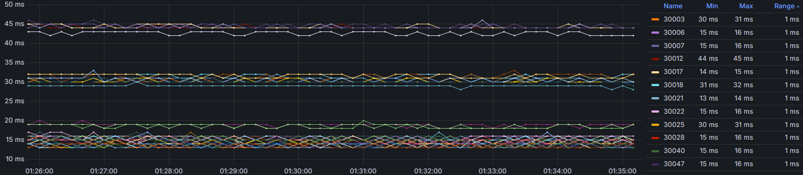

# Network Test

Send IP4/IP6 TCP/UDP/ICMP packets and count how many have reached the destination, the time it took to arrive and the TTL.

## Build instructions

### cmake

```bash
mkdir build
cd build
cmake ..
cmake --build .
```

### Alpine (static linking with musl)

```bash
apk add g++ libpcap-dev openssl-dev openssl-libs-static zstd-dev zstd-static
g++ src/*.cpp -o nt -pthread -O2 -flto -fwhole-program -static -lzstd -lcrypto -lpcap -Wno-deprecated-declarations
```

## Configuration

All command-line arguments are interpreted as configuration file names.
Configure the program using the following options.

- `secret`: Specify the same key on all hosts.
- `user`: User to switch to after initialization.
- `group`: Group to switch to after initialization.
- `dev`: Network device to listen for packets on.
- `src_port`: First source port number.
- `dst_port`: First destination port number.
- `ports_count`: Number of ports to use, starting from `src_port` and `dst_port`.
- `packet_size`: Packet size in bytes, including the IP header.
- `interval`: Interval between send events (in milliseconds).
- `path4`: List of IPv4 addresses to send and receive packets.
- `path6`: List of IPv6 addresses to send and receive packets.
- `queue_dir`: Directory for the metrics queue.
- `queue_max_file_size`: Maximum uncompressed metrics file size in bytes.
- `queue_rotate_after_size`: Flush metrics to file after size bytes have collected in memory.
- `queue_max_file_count`: Maximum number of metrics files in `queue_dir`.

Options `path4` and `path6` follow a similar pattern: `local-name local-ip remote-name remote-ip`.  If the IP is dynamic, it can be replaced with `-`. At least one end must have a static address.

Files in `queue_dir` are compressed with _zstd_. The program will refuse to start if any unrecognizable file names are found in `queue_dir`. A new metrics file is created when `queue_dir` is empty or `queue_rotate_after_size` bytes have collected in memory. If `queue_dir` has more than `queue_max_file_count` files, metrics will be dropped.

Example configuration file:
```text
secret my_secret_key
queue_dir /path/to/queue
user myuser
group mygroup
dev eth0
src_port 12345
dst_port 54321
ports_count 10
# Always send from 1.1.1.1 to 2.2.2.2.
path4 myname 1.1.1.1 abc 2.2.2.2
# Wait for 3.3.3.3 to start sending.
path4 myname 3.3.3.3 def -
# Use route table to select local IP.
path6 myname - def 2001:db8::1
```

## Metrics format

The metrics files use TSV format, with each record on a separate line, and are compressed using _zstd_.

One send event is recorded every `interval` milliseconds.
Each send event represents 3 packets (TCP, UDP and ICMP).

```
"s" <sent-timestamp> <ip-version> <src-name> <dst-name> <dst-port>
```

Every packet received is recorded as:

```
"r" <sent-timestamp> <trip-time> <ip-version> <ip-protocol> <src-name> <dst-name> <src-ip> <dst-port> <ip-ttl>
```

### Examples

On the sending host:
```
s 1730044987400 IP6 w24 ash 30045
```

On the receiving host:
```
r 1730044987400 108 IP6 ICMP w24 ash 2001:db8::1 30045 235
r 1730044987400 108 IP6 UDP w24 ash 2001:db8::1 30045 235
r 1730044987400 108 IP6 TCP w24 ash 2001:db8::1 30045 235
```

## Grafana

An example program that downloads the metrics files using rsync and imports them into _VictoriaMetrics_ is provided in [vicmet.cr](import/vicmet.cr).

### Examples

Visualization showing multiple network paths in one direction.
The _Name_ column shows the UDP destination port number.


